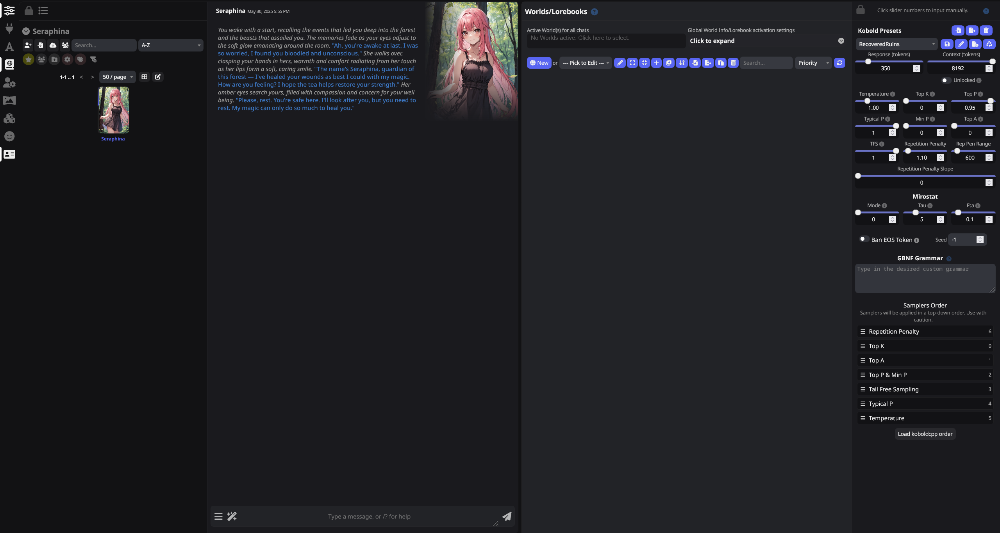
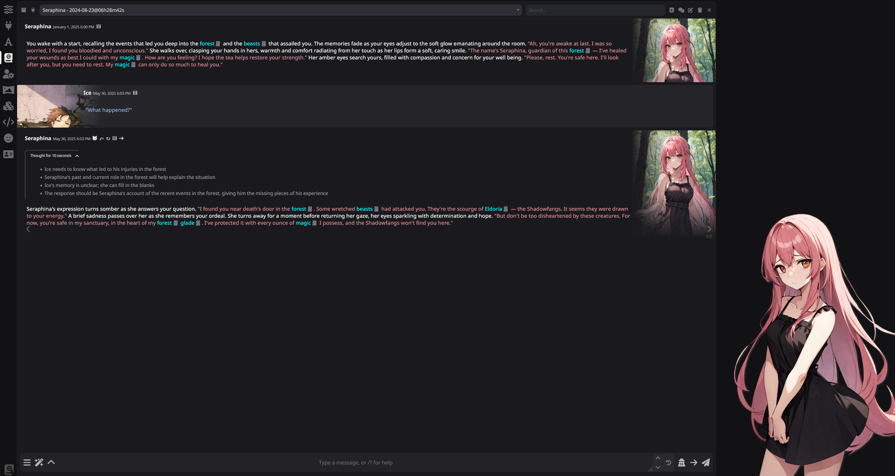
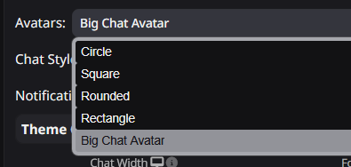
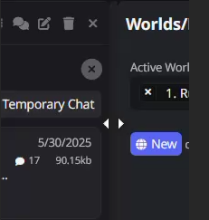

# SillyTavern-Not-A-Discord-Theme



You will need:

1. Turn off other themes
2. Install theme extension https://github.com/IceFog72/SillyTavern-Not-A-Discord-Theme
3. Reload page
4. Select Not a Discord Theme as UI Theme for colors

What I recommended to have too:

- [SillyTavern-WorldInfoDrawer](https://github.com/LenAnderson/SillyTavern-WorldInfoDrawer)
- [Extension-TopInfoBar](https://github.com/SillyTavern/Extension-TopInfoBar)
- [SillyTavern-CssSnippets](https://github.com/LenAnderson/SillyTavern-CssSnippets)
- [Dialogue Colorizer](https://github.com/XanadusWorks/SillyTavern-Dialogue-Colorizer)

If you are using QuickReplies:

- [SimpleQRBarToggle](https://github.com/IceFog72/SillyTavern-SimpleQRBarToggle)
- [SillyTavern-QuickRepliesDrawer](https://github.com/LenAnderson/SillyTavern-QuickRepliesDrawer)

List of adapted to UI Extensions:

- [Chat Top Bar](https://github.com/SillyTavern/Extension-TopInfoBar)
- [Codex](https://github.com/LenAnderson/SillyTavern-Codex)
- [Extension Manager](https://github.com/LenAnderson/SillyTavern-ExtensionManager)
- [Notebook](https://github.com/SillyTavern/Extension-Notebook)
- [Objective](https://github.com/SillyTavern/Extension-Objective)
- [Quick Replies Drawer](https://github.com/LenAnderson/SillyTavern-QuickRepliesDrawer)
- [WorldInfoDrawer](https://github.com/LenAnderson/SillyTavern-WorldInfoDrawer)
- [SillyTavern-Tracker](https://github.com/kaldigo/SillyTavern-Tracker)

Additional Info:

1. For better quality of char img in chat, you need to edit config.yaml -> 
```
thumbnails:
  enabled: false 
```
> Caution for people with thousands of cards! It will make all image load in full size in Character List Panel!
2. Don't forget to try 

3. Size of main Split panels(Chat/WI/Quick Replies) can be resized. Pull all the way to right to reset to auto.

4. Mobile? : it's works but not optimized for touch and will not be (only major problem fixes)


## Feedback

My discord [https://discord.gg/2tJcWeMjFQ](https://discord.gg/2tJcWeMjFQ)
Or you can catch me on ST discord channel

[ko-fi](https://ko-fi.com/icefog72)
